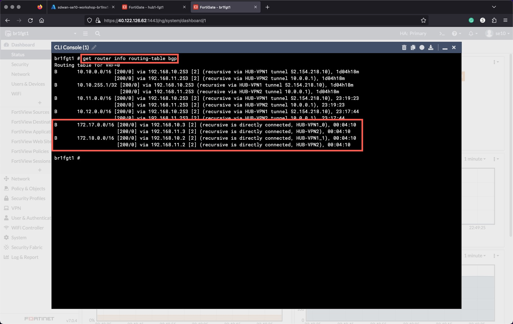

# About TEC Recipes

TEC Recipes provide the learner with the opportunity to put into practice newly developed skills in an easy to launch environment that can be used for customer engagements. At a minimum a TEC Recipe will include the following:

* A use case description
* An integrated lab and demo environment

  * Informational call-outs for key points to discuss or highlight to a customer
  * Questions that could be asked while giving the TEC Recipe as a demo
  * Points of value that relate the business value to the technical feature
* A reference architecture(s)

Optional components may be included for certain use cases

The TEC Recipe will not be a completely, self-contained learning experience for a single product. A TEC Recipe will cover features and often multiple products where they relate to the use case of interest.  

Deployments will be automated for those tasks that are not salient to the learning or demonstration activity in the use case. For example, for a TEC Recipe focused on Indicators of Compromise, the system may deploy a FortiGate and FortiAnalyzer with configurations for these systems. However, the leaner will have to configure the Event Handlers for IOC setup.  

## Azure SD-WAN TEC Recipe

Introduction:
As enterprises adopt the cloud as the new core for application hosting, remote sites require secure, reliable connectivity with an optimal user experience to access those cloud and SaaS applications.  In fact, cloud access is SD-WAN's primary use case for IaaS and SaaS-hosted services.  Fortinet's Cloud On-Ramp capabilities using SD-WAN are differentiated in the following ways:

* Integrated Security and SD-WAN policy configuration and workflows
* Unique ability to provide scale up performance for higher bandwidth into cloud environments
* Decentralized orchestration for better survivability and easier deployment of SD-WAN overlays
* Single OS for consistent policy and overlay deployment on all software-defined networks (SDNs)

The purpose of this TEC Recipe is to familiarize the learner with routing, data-plane, and architectural concepts specific to the Azure Cloud environment.  Other TEC Recipes are available to cover SD-WAN feature deployment.

## TEC Recipe Objectives

* Deploy the SD-WAN architecture using Terraform
* Configure Azure components
  * Load Balancer
  * VNET Peering
  * Route Server
  * vWAN and vWAN Hub
* Understand the different available architecture options

***
***

## Chapter 1 - Setting up the environment (40min)

<details>

### Task 1 - Setup your AzureCloud Shell

* Login to Azure Cloud Portal [https://portal.azure.com/](https://portal.azure.com/) with the provided login/password

    
    

* Click the link "Skip for now (14 days until this is required)" do not click the "Next" button

    

* Click the "Next" button

    

* Click on Cloud Shell icon on the Top Right side of the portal

    

* Select **Bash**

    

* Click on **Show advanced settings**

    
* Select
  * Use existing Resource Group  - it ***should*** auto populate with USERXX-workshop-sdwan (USERXX is your Username)
  * Use existing Storage account - it ***should*** auto populate with USERXX########## (########## is a random string)
  * Use existing File Share  - type **cloudshellshare**
* Click "Attach Storage"

    

* You should now have access to Azure Cloud Shell console

    

### Task 2 - Run the Terraform Deployment

Perform the following step in your Cloudshell console to create your environment.

1. Clone the Github repo
1. Change directory to the `technical-recipe-azure-sdwan/terraform` folder
1. Run `terraform init`
1. Run `terraform plan` for your `username`
1. Run `terraform apply` for your `username`

> **Copy and paste these commands into your Cloud Shell console.**
> The terraform variable `username` will be populated with the value of the environment variable `USER`

```sh
git clone https://github.com/FortinetSecDevOps/technical-recipe-azure-sdwan
cd ./technical-recipe-azure-sdwan/terraform/
terraform init
terraform plan -var="username=${USER}"
terraform apply -var="username=${USER}" -auto-approve
```

  
  
  

* The current state of the Architecture is shown below.

    

### Task 3 - Terraform Verifications

  1. Using the Terraform output, verify that you have Web and SSH access to the FortiGates.

      

      * Terraform output can be redisplayed at any point as long as you are in the `./technical-recipe-azure-sdwan/terraform/` directory, by using the command `terraform output`

        ```sh
        cd
        cd ./technical-recipe-azure-sdwan/terraform/
        terraform output
        ````

  1. Connect to the Branch sites FortiGates and check the VPN IPSec status.
  1. Connect to the Hub FortiGates and check the WAN IP

### Chapter 1 - QUIZ

1. FortiGates in the Hub do not have public IPs, how are they accessible via the Web UI?

1. Why are the VPN connections down?

  <details>
  <summary>Quiz 1 Answers</summary>

1. **FortiGates in the Hub do not have public IPs, how are they accessible via the Web UI?**

    * The Public IPs on the external load balancers for the Hub, Branch1 and Branch2 FortiGates have inbound NAT rules setup.

1. **Why are the VPN connections down?**

    * The external load balancer for the Hub FortiGates requires load balancing rules for UDP 500 and UDP 4500.

  </details>
</details>

***

## ***Discussion Points During a Demo - Chapter 1***

Fortinet provides a large library of infrastructure as code (IaC) templates to deploy baseline and iterate POC and production environments in public cloud.  IaC support includes Terraform, Ansible, and cloud-specific services such as Azure ARM, AWS Cloudformation, and Google Deployment (jinja) templates. Terraform Providers are available for FortiGate and FortiManager to insert and iterate running configuration.

For more information, review the following:

* [FortiOS 7.2 Admin Guide](https://docs.fortinet.com/document/fortigate/7.2.2/administration-guide/763117/terraform-fortios-as-a-provider)

* [Terraform Providers](https://fndn.fortinet.net/index.php?/cloud/terraform/)

## Key questions during your demo - Chapter 1

When giving this TEC Recipe as as demo, the following questions will provide a basis for next steps and future meetings:

* Has your organization standardized on an IaC tool-set for infrastructure provisioning and iteration?
* How are the responsibilities for infrastructure assigned?  Does cloud network fall under a DevOps, Cloud Networking, or Application Delivery team, as examples?
* What is view on how IaC can improve workflows?
* Is workflow automation in cloud and cross-organizational collaboration important within your cloud business?

***

## Chapter 2 - Hub and Branch VPN Connectivity (20min)

<details>

### Task 1 - Add FortiGates to Hub Load Balancer Backend Pool

1. **Select** the Hub External Load Balancer **sdwan-USERXX-workshop-hub1-elb1**
1. **Click** Backend pools
1. **Select** "hub1-ext-fgt"
1. **Click** "+Add"
1. **Select** sdwan-USERXX-workshop-hub1-fgt1 and sdwan-USERXX-workshop-hub1-fgt2 **port1 interfaces**
    * 10.10.0.4
    * 10.10.0.5
1. **Click** "Add"
1. **Click** "Save"

  
  
  
  
  
  

### Task 2 - Create load balancing rules for IPSEC VPN Traffic

1. **Select** the Hub External Load Balancer **sdwan-USERXX-workshop-hub1-elb1**
1. **Click** on Load balancing rules
1. **Click** "+ Add"
1. **Create** Load balancing rules for UDP 500 and UDP 4500 - ***one rule for each***
    * Name - `udp-500`
    * Name - `udp-4500`

    |Option|value||value
    |---|---|-|---|
    |Name|udp-500||udp-4500|
    |IP Version|IPv4||IPv4|
    |Frontend IP address|hub-pip1||hub-pip1|
    |Backend pool|hub1-ext-fgt||hub1-ext-fgt|
    |Protocol|UDP||UDP|
    |Port|500||4500|
    |Backend port|500||4500|
    |Health probe|hub1-elb1-probe||hub1-elb1-probe|
    |Session persistence|None||None|
    |Floating IP|Disabled||Disabled|
    |Outbound SNAT|Use implicit||Use implicit|

    
    
    
    
    

### Task 3 - Hub and Branch VPN Connectivity Verification

**Verify** that the FortiGates are responding to Azure Load Balancer Health Checks

1. **Select** the Hub External Load Balancer **sdwan-USERXX-workshop-hub1-elb1**
1. **Click** Insights
1. **Close** the Metrics panel

Green, Red, and/or Yellow lines indicate FortiGate reachability.

**Clicking** the "Refresh" button a few times, if yellow lines are present. Eventually (30 seconds) red and green lines will replace the yellow.

The diagram shows the load balancing rules along with the Inbound NAT Rules configured on the load balancer.

  
  
  

**Verify** that the VPN connections from the Branches to the Hub are UP, check Branches 1, 2 and 3.

1. **Login** to each Branch FortiGate
1. **Click** "Dashboard"
1. **Click** "Network"
1. **Click** "Expand to full screen" in the IPsec widget

    
    

**Verify** that BGP peering with the Hub is UP and that the Branch FortiGates learned the Hub and other Branches' CIDRs. Check all Branch FortiGates.

1. Open a FortiGate CLI session
1. Run the Command `get router info routing-table all`

    

* The current state of the Architecture is shown below.

    

### Chapter 2 - QUIZ

1. Why is one FortiGate depicted as unhealthy by the Azure Hub External Load Balancer?

1. Why is NAT used to access the FortiGates, but for IPSEC VPN traffic Load balancing rules are used?

1. Do FortiGates in the Branches learn Spoke11 and Spoke12 CIDRs?

  <details>
  <summary>Quiz 2 Answers</summary>

1. **Why is one FortiGate depicted as unhealthy by the Azure Hub External Load Balancer?**

    * The passive FortiGate does not respond to the load balancer health probes. Only after a failover event will the newly active FortiGate start responding to health probes.

1. **Why is NAT used to access the FortiGates, but for IPSEC VPN traffic Load balancing rules are used?**

    * NAT allows each individual FortiGate to be accessed via the Public IP of the load balancer. A load balancer rule would only allow access to the Active FortiGate.

1. **Do FortiGates in the Branches learn Spoke11 and Spoke12 CIDRs?**

    * Spoke11 and Spoke12 CIDRs are not yet known to the Hub FortiGate so the Branches will not learn them yet.

  </details>
</details>

## ***Discussion Points During a Demo - Chapter 2***

When discussing load balanced traffic with the customer, point out key details about the Azure Load Balancers such as the following:

* Azure LB uses 5-tuple hash for traffic distribution
* IPSec in an Active/Active configuration is not supported as session stability cannot be guaranteed to IkE rekeys, and deterministic IP termination.  
* TCP/UDP headers are rewritten to the backend pool.  HTTP/s headers are not changed.  
* Legacy applications or those requiring long-lived sessions could see performance issues due to TTL limitations on the LB.  

When connecting IPSec traffic from remote inter-regional sites, the customer's architecture could benefit from dedicated FortiGates to support IPSec.  This is a benefit where large traffic loads are supported for deep packet inspection and where there is a lot of E/W traffic.  Dedicated FortiGates for IPSec allow the opportunity to scale VPN traffic using IPSec Aggregate without impacting performance of traffic inspection.  Details on IPSec Aggregate can be found [here](https://docs.fortinet.com/document/fortigate/7.2.3/administration-guide/779201/aggregate-and-redundant-vpn).

Don't forget that the CLI is still a great place to get targeted information with a single command. For example, viewing the FortiGate known routes with the CLI command `get router info routing-table all`

## Key questions during your demo - Chapter 2

When giving this TEC Recipe as as demo, the following questions will provide a basis for next steps and future meetings:

* How sensitive are your applications to session timeout?  Do they require large TTL values for long-lived sessions?
* What type of VPN scaling (tunnel count and bandwidth) are required for your deployment?  
* How much east/west traffic versus north/south traffic will be supported?  
* What types of inspection will be required between various VNets?
* Is advanced BGP configuration required? (FortiGate-to-FortiGate can support advanced BGP metrics unlike Azure's services)

***

## Chapter 3 - Azure Route Server Presentation (30min)

## ***Discussion Points During a Demo - Chapter 3***

The Azure Route Server (ASR) is used to connect NVAs to the Azure network to simplify VNet routing with external networks.  SD-WAN is a primary use case for the ASR where BGP routes are exchanged between a premise-based and the ASR to advertise premise-originated routes to the VNets and VNet routes to the premise.  For many customers, this may be a great fit.  For some customers, there may be more complex routing requirements such as multiple egress points,load balanced routes, large number of BGP peers, large volume of routes (>1000); where these needs require advanced BGP.  More complex use cases will require FortiGate to FortiGate peering in those cases.  Let your customer know about Fortinet's ability to support [advanced dynamic routing services](https://docs.fortinet.com/document/fortiswitch/7.2.2/administration-guide/939731/bgp-routing).  

## Key questions during your demo - Chapter 3

When giving this TEC Recipe as as demo, the following questions will provide a basis for next steps and future meetings:

* Describe your organizations routing requirements.  
* Does your environment require more than 8 BGP peers or more than 1000 routes
* Do you need to extend other routing protocols, such OSPF or ISIS into the Azure environment?

***

## Chapter 4 - Hub VNET and Spoke VNET Connectivity (40min)

***[Configuration and troubleshooting exercise - estimated duration 40min]***

<details>

### Task 1 - Create Hub and Spoke VNET peering

Create a VNET peering between the Spoke11 VNET and the Hub VNET

1. **Select** Spoke VNET, **USERXX-workshop-sdwan-spoke11**
1. **Click** on Peerings
1. **Add** peering to Hub VNET, **USERXX-workshop-sdwan-hub1**

    This virtual network
    * Peering link name - `spoke11-to-hub`
    * Traffic to remote virtual network - "Allow (default)"
    * Traffic forwarded from remote virtual network - "Allow (default)"
    * Virtual network gateway or Route Server - "Use the remote virtual network's gateway or Route" Server

    Remote virtual network
    * Peering link name - `hub-to-spoke11`
    * Virtual network deployment model - "Resource manager"
    * Subscription - "Internal-Training"
    * Virtual network - "**USERXX-workshop-sdwan-hub1**"
    * Traffic to remote virtual network - "Allow (default)"
    * Traffic forwarded from remote virtual network - "Allow (default)"
    * Virtual network gateway or Route Server - "Use this virtual network's gateway or Route Server"

1. **Repeat** for Spoke12 VNET, **USERXX-workshop-sdwan-spoke12**
1. **Select** Spoke VNET, **USERXX-workshop-sdwan-spoke11**
1. **Click** on Peerings
1. **Add** peering to Hub VNET, **USERXX-workshop-sdwan-hub1**

    This virtual network
    * Peering link name - `spoke12-to-hub`

    Remote virtual network
    * Peering link name - `hub-to-spoke12`

>You will see errors until all the correct selections are made.

  
  
  
  

**Verify** that the Branch FortiGates have learned the Spoke11 VNET and Spoke12 VNET CIDRs. Run the Command `get router info routing-table all` on all the Branch FortiGates.

### Task 2 - Check Azure Route Server Configuration and Learned Routes

1. **Select** the Azure Route Server **USERXX-workshop-sdwan-RouteServer** contained within your Resource Group.
1. **Click** on Peers on the left side of the menu, verify the connection to the Hub FortiGates

    
    

1. **List** the routes learned by Azure Route Server, run the commands below from your Azure Cloud Shell

* The variable `${USER}` in the commands reads your username from the environment

```bash
az network routeserver peering list-learned-routes -g ${USER}-workshop-sdwan --routeserver ${USER}-workshop-sdwan-RouteServer --name sdwan-fgt1
az network routeserver peering list-learned-routes -g ${USER}-workshop-sdwan --routeserver ${USER}-workshop-sdwan-RouteServer --name sdwan-fgt2
```


```json
{
  "RouteServiceRole_IN_0": [
    {
      "asPath": "64622",
      "localAddress": "10.10.2.4",
      "network": "10.10.255.1/32",
      "nextHop": "10.10.1.4",
      "origin": "EBgp",
      "sourcePeer": "10.10.1.4",
      "weight": 32768
    },
    {
      "asPath": "64622",
      "localAddress": "10.10.2.4",
      "network": "172.18.0.0/16",
      "nextHop": "10.10.1.4",
      "origin": "EBgp",
      "sourcePeer": "10.10.1.4",
      "weight": 32768
    },
    {
      "asPath": "64622",
      "localAddress": "10.10.2.4",
      "network": "172.17.0.0/16",
      "nextHop": "10.10.1.4",
      "origin": "EBgp",
      "sourcePeer": "10.10.1.4",
      "weight": 32768
    },
    {
      "asPath": "64622",
      "localAddress": "10.10.2.4",
      "network": "172.16.0.0/16",
      "nextHop": "10.10.1.4",
      "origin": "EBgp",
      "sourcePeer": "10.10.1.4",
      "weight": 32768
    }
  ],
  "RouteServiceRole_IN_1": [
    {
      "asPath": "64622",
      "localAddress": "10.10.2.5",
      "network": "10.10.255.1/32",
      "nextHop": "10.10.1.4",
      "origin": "EBgp",
      "sourcePeer": "10.10.1.4",
      "weight": 32768
    },
    {
      "asPath": "64622",
      "localAddress": "10.10.2.5",
      "network": "172.18.0.0/16",
      "nextHop": "10.10.1.4",
      "origin": "EBgp",
      "sourcePeer": "10.10.1.4",
      "weight": 32768
    },
    {
      "asPath": "64622",
      "localAddress": "10.10.2.5",
      "network": "172.17.0.0/16",
      "nextHop": "10.10.1.4",
      "origin": "EBgp",
      "sourcePeer": "10.10.1.4",
      "weight": 32768
    },
    {
      "asPath": "64622",
      "localAddress": "10.10.2.5",
      "network": "172.16.0.0/16",
      "nextHop": "10.10.1.4",
      "origin": "EBgp",
      "sourcePeer": "10.10.1.4",
      "weight": 32768
    }
  ]
}
```

> The passive FortiGate will produce empty output

```json
{
  "RouteServiceRole_IN_0": [],
  "RouteServiceRole_IN_1": [],
  "value": null
}
```

### Task 3 - Create a Dynamic SDN object [troubleshooting required]

Can the Hub FortiGate Azure SDN Connector read the Azure environment?

* **Troubleshoot and Make the required changes to allow the FortiGate to retrieve the SDN filters.**

On the Hub FortiGate view the Azure SDN Connector

1. **Login** to the Hub FortiGate
1. **Click** "Security Fabric"
1. **Click** "External Connectors"
1. **Hover** Over Azure Connector - "AzureSDN"
1. **Click** "View Connector Objects"

On the Hub FortiGate debug the Azure SDN Connector


1. **Open** a FortiGate CLI session
1. **Enter** the SDN connector debug commands

      ```bash
      diagnose debug application azd -1
      diagnose debug enable
      ```

In a few minutes the output will indicate the SDN Connector's inability to make an call to the Azure Management API.


Hints:
***

* Branch3 FortiGate is able to retrieve the filters, why that is not the case for the FortiGates behind Load Balancers?
* Branch3 FortiGate is standalone, all other FortiGates are in Active-Passive HA, how does that affect traffic to retrieve SDN information?
* Hub External Load Balancer needs a management nic backend pool and a TCP rule, any port suffices. This rule is about letting TCP traffic out. The External Load Balancer will let the response traffic back in because the traffic originated internally.

1. **Create** a backend pool on the Hub load balancer using the Hub FortiGate Management Interfaces

    * Name - `mgmt-pool`
    * Interfaces
        * 10.10.4.4
        * 10.10.4.5

    
    
    

1. Create a TCP Load Balancer Rule, any port will do, e.g. 13000. This rule will allow TCP response traffic back through the load balancer, when to a TCP request originated from a device in a backend pool associated to the load balancer.

    * Name - `tcp-rule`
    * Frontend IP address - "hub-pip1"
    * Backend pool - "mgmt-pool"
    * Protocol - "TCP"
    * Port - `13000`
    * Backend port - `13000`
    * Health probe - hub1-elb1-probe (TCP:8008)
    * Session Persistence - "None"
    * Idle timeout (minutes) - "4"
    * TCP reset - "Disabled"
    * Floating IP - "Disabled"
    * Outbound source network address translation (SNAT) - "Use default outbound access"

    

Utilize the SDN connector results in a Dynamic Address Object and Policy

1. **Login** to the Hub FortiGate
1. **Click** "Policy & Objects"
1. **Click** "Addresses"
1. **Create New** dynamic address object on the Hub FortiGate, named `Spoke_VNETs` that resolves to the Spoke VNETs VMs

    * Name - `Spoke_VNETs`
    * Type - "Dynamic"
    * SDN Connector - "AzureSDN"
    * SDN address type - "Private"
    * Filter
        * se10-workshop-sdwan-spoke11
        * se10-workshop-sdwan-spoke12
    * Interface - "priv (port2)"

    

**Use** the address object in an existing Policy to restrict traffic coming from the Branches to only VMs in the Spoke VNETs.

1. **Click** "Policy & Objects"
1. **Click** "Firewall Policy"
1. **Edit** the policy "Branch to Cloud"
1. **Set** the policy destination to "Spoke_VNETs"

    
    
    

### Task 4 - Traffic generation

Generate Traffic from Branch1 Primary FortiGate:

1. Connect to the Branch1 Primary FortiGate
1. Configure ping-options to initiate traffic from FortiGate's private nic (port2).
    * Source IP depends on which Branch1 FortiGate is primary br1fgt1 or br1fgt2
        * `execute ping-options source 172.16.2.4`
        * `execute ping-options source 172.16.2.5`
    * Set the ping repeat count
        * `execute ping-options repeat-count 100`

1. Initiate a ping to Spoke11 and Spoke12 Linux VMs (10.11.1.4 and 10.12.1.4)
    * `execute ping 10.11.1.4`
    * `execute ping 10.12.1.4`

    

    

Generate Traffic from Branch1 Linux VM:

1. Enable serial console access on Branch1 Linux VM
    * **Select** VM **sdwan-USERXX-workshop-br1lnx1**
    * **Click** "Boot diagnostics"
    * **Click** "Settings"
    * ***Select** **Enable with managed storage account (recommended)**
    * **Click** Save

        
        
        

1. Ping from VM Serial Console
    * **Click** "Serial Console"

    * Initiate a ping to Spoke11 and Spoke12 Linux VMs
    * Does it work?

        ```bash
        ping 10.11.1.4
        ping 10.12.1.4 
        ```

    

    

* The current state of the Architecture is shown below.

    

### Chapter 4 - QUIZ

1. What was missing to allow the FortiGates to retrieve SDN connector filters?

1. Why is the FortiGate only able to retrieve the SDN connector filters in its own Resource Group?

1. Why is the Branch FortiGate able to reach the remote Spoke VNETs VMs (10.11.1.4 and 10.12.1.4) but the Linux VM behind the Branch1 FortiGate cannot?

1. FortiGates at Branch1 and Branch2 site are both behind Azure Load Balancers (behind NAT). Will Branch1 to Branch2 traffic successfully establish an ADVPN shortcut?

  <details>
  <summary>Quiz 4 Answers</summary>

1. **What was missing to allow the FortiGates to retrieve SDN connector filters?**

    * The FortiGate's management interfaces need access to the Azure APIs via a public IP address. This required adding a backend pool for the FortiGate management interfaces and a TCP load balancing rule to let the API response to an internal request back through the external load balancer.

1. **Why is the FortiGate only able to retrieve the SDN connector filters in its own Resource Group?**

    * The FortiGate VM Azure Identity was given the "Reader" role with the scope of the Resource Group.

1. **Why is the Branch FortiGate able to reach the remote Spoke VNETs VMs (10.11.1.4 and 10.12.1.4) but the Linux VM behind the Branch1 FortiGate cannot?**

    * The Linux VM does not know how to get to the FortiGate because no default route was defined for the route table which controls the subnet the Linux VM is in.

1. **FortiGates at Branch1 and Branch2 site are both behind Azure Load Balancers (behind NAT). Will Branch1 to Branch2 traffic successfully establish an ADVPN shortcut?**

    * Yes

  </details>
</details>

## ***Discussion Points During a Demo - Chapter 4***

Azure Virtual Network (VNET) Peering provides the ability to connect multiple VNETs together and direct traffic flow based on existence of a gateway in a connected peer or with a user defined route (UDR) in a route table.

Utilizing an Azure Route Server (ARS) and setting the FortiGates as a BGP peers enables the FortiGates to be updated with newly available routes or the removal of routes as VNETs are peered or when a peering relationship is removed.

From a FortiGate Policy perspective the ability to be dynamically aware of a changing environment is provided by the Azure SDN Connector. The SDN Connector is continually polling the environment and logging the changes, FortiGate dynamic address objects and Automation Stitches can take full advantage of the SDN connector to update policy and effect internal and external changes.

An Azure Route Table provides a way to specifically direct traffic, when used in conjunction with an ARS or FortiGate static routes protected workload traffic can be fully managed.

Several settings in Azure determine traffic flow review the following for Azure Routing

* [Azure Route Server](https://learn.microsoft.com/en-us/azure/route-server/)
* [Azure Route Tables](https://learn.microsoft.com/en-us/azure/virtual-network/tutorial-create-route-table-portal)

## Key questions during your demo - Chapter 4

* Do you currently use, planning to use or just learning about VNET peering?
* Are you aware of the capabilities that the Azure SDN Connector provides?
* Are you using dynamic address objects or Automation Stitches?

***

## Chapter 5 - Branch to Cloud and Branch to Branch Connectivity (20min)

<details>

### Branch to Cloud

### Task 1 - Create a User Defined Route (UDR) in the Branch route tables

1. **Click** on the Branch1 private route table **sdwan-USERXX-workshop-branch1_rt**
1. **Click** Routes
1. **Add** a default route for `0.0.0.0/0` that points to the Branch1 **Internal Load balancer listener IP**
    * Name - `default`
    * Address prefix destination - "IP Addresses"
    * Destination IP addresses/CIDR ranges - `0.0.0.0/0`
    * Next hop type - "Virtual appliance"
    * Next hop address
      * Branch1 - `172.16.2.10`
      * Branch2 - `172.17.2.10`
      * Branch3 - `172.17.2.4`
1. **Repeat** for **Branch2** and **Branch3** Route Tables
  
    * Be sure to use the correct IP as the next hop, that is the correct internal Load balancer frontend IP or FortiGate internal interface.

    * The next hop is a load balancer or a stand-alone FortiGate.

    
    
    
    

### Task 2 - Generate Branch traffic to the Hub

1. **Connect** to the Branch1 Linux VM via the serial console
1. **Generate** traffic to Hub

    ```bash
     ping 10.11.1.4
     ping 10.12.1.4 
    ```

    

1. Why does it work now?

* Now when traffic leaves the branch linux VM the next hop is the Branch FortiGate, because the Azure route table default route.

### Task 3 - Check Effective Routes

Check the Effective Routes for Spoke 11 Linux VM

1. **Click** on Spoke11 Linux VM **sdwan-USERXX-workshop-spoke11-subnet1-lnx**
1. **Click** on Networking
1. **Click** on the VM Nic **sdwan-se10-workshop-spoke11-subnet1-lnx-nic**
1. **Click** on **Effective routes**

    
    

1. **Check** that Azure Route Server has injected the Branch sites CIDRs learned from the FortiGate

    

Check the Effective Routes for Hub FortiGate

1. **Click** on the Hub FGT **sdwan-USERXX-workshop-hub1-fgt1**
1. **Click** on Networking
1. **Click** on the VM Nic port1 Nic **hub1-fgt1-port1**
1. **Click** on **Effective routes**

    
    

Has Azure Route Server injected the Branch sites CIDRs learned from the FortiGates?

* In this case it is the FortiGate that knows how to route from the Hub to the Branches, but these routes are not given to the Azure Route Server. These BGP routes are learned through the IPsec VPN connections.

### Branch to Branch

### Task 4 - Generate Traffic between Branches

1. **Connect** to the Branch1 Linux Host via the serial console - **sdwan-USERXX-workshop-br1lnx1**
1. **Generate** traffic to Branch2 Linux VM and Branch3 Linux VM

    ```bash
     ping 172.17.5.4
     ping 172.18.5.4
    ```

    

1. **Login** to any Branch FortiGate
1. **Check** from the CLI if an ADVPN shortcut has been created.
1. **Run** the command `get router info routing-table bgp`

    

### Chapter 5 - QUIZ

1. Why has the Azure Route Server (ARS) injected Branch site CIDRs to the Spoke VNET protected subnet but not the FortiGate private subnet?

1. The Branch external load balancer has two front end public IP. How do we ensure that traffic egressing Branch1 on port1 (isp1) always has the same public IP applied? Same for traffic egressing Branch1 on port3 (isp2)

  <details>

  <summary>Quiz 5 Answers</summary>

1. **Why has the Azure Route Server (ARS) injected Branch site CIDRs to the Spoke VNET protected subnet but not the FortiGate private subnet?**

    * Route propagation into the FortiGate private subnet is set to no.

1. **The Branch external load balancer has two front end public IP. How do we ensure that traffic egressing Branch1 on port1 (isp1) always has the same public IP applied? Same for traffic egressing Branch1 on port3 (isp2)?**

    * By using outbound rules associated to backend pools connected to those ports on each FortiGate.

  </details>
</details>

## ***Discussion Points During a Demo - Chapter 5***

Through the use of IPSEC an ADVPN is established between branches, the complexity of branch to branch connectivity is seamlessly added to the environment. Determining workload traffic routing can be done by reviewing the network interface's effective routes. When troubleshooting a perceived networking issue, checking an interfaces effective routes is a first step in determining if the interface has awareness of the routes or what the next-hop is for the route.

`ping` can be an effective way to determine reachability in the Cloud, however a `ping` may not fully exercise the services provided by the workloads. FortiGate policy should be set to allow/disallow service ports and protocols.

## Key questions during your demo - Chapter 5

* Is ADVPN establishment important to your deployments?
* How certain are you that your workloads are not aware of other routes?
* Have you experienced traffic to your workloads that has been inspected by the FortiGates on arrival but is not seen returning through the FortiGate?

***

## Chapter 6 - Redundancy (20min)

<details>

### Task 1 - Generate ICMP traffic

* Connect to the Branch1 Linux Host via the serial console - **sdwan-USERXX-workshop-br1lnx1**
* Ping a resource in a remote branch site - **sdwan-USERXX-workshop-spoke11-subnet1-lnx**
  * `ping 10.11.1.4`
  * Let the ping run

### Task 2 - Initiate a failover

* Connect to the Branch1 Primary FortiGate . Initiate a failover by rebooting the primary FortiGate or by forcing a failover via the CLI

  ```bash
  execute ha failover set 1
  ```

* Monitor the number of **lost Pings** and the **failover time**
* How long did it take?
* Have the VPNs to the Hub been renegotiated upon failover or maintained?

### Task 3 - Generate TCP traffic

* Ensure that both Branch1 FortiGates in the cluster are up and running
* Connect to the Branch1 Linux Host via the serial console - **sdwan-USERXX-workshop-br1lnx1**
* Generate an SSH session to the Spoke Linux VM - **sdwan-USERXX-workshop-spoke11-subnet1-lnx**

   ```bash
   ssh USERXX@10.11.1.4
   ```

* From Spoke Linux VM SSH session generate a continuous stream of connections to track the failover event

   ```bash
   while true; date; do curl -I -sw '%{http_code}'  https://www.lemonde.fr/ ; echo -e "\n================="; sleep 1 ; done
   ```

* Connect to the Branch1 Primary FortiGate . Initiate a failover by rebooting the primary FortiGate or by forcing a failover via the CLI

* Monitor the SSH connection
* Did you lose the TCP connection?

### Chapter 6 - QUIZ

1. How long was your failover time?

1. Why did we lose the SSH (TCP) session with a "short" failover time?

  <details>

  <summary>Quiz 6 Answers</summary>

1. **How long was your failover time?**

    * It should have been between 15 - 25 seconds.

1. **Why did we lose the SSH (TCP) session with a "short" failover time?**

    * TCP sessions are not maintained by the Azure load balancer.

  </details>

</details>

## ***Discussion Points During a Demo - Chapter 6***

In Active/Passive FortiGate deployments the failover methodology has an impact on the continuation of traffic flow. Utilizing Azure Load Balancers as traffic direction devices in a FortiGate Active/Passive deployment, the load balancer will only send traffic to the FortiGate that is responding to the load balancer's health probe. A FortiGate in passive mode will not respond to the load balancer health probe, causing the load balancer to mark the passive FortiGate as unhealthy and not send traffic to the passive FortiGate. In a failover event the previously passive FortiGate will start responding to the load balancer health probe, resulting in traffic being directed to the newly active FortiGate.

Azure load balancers do not maintain TCP sessions which will need to be restarted, however UDP sessions, specifically IPSEC connections are readily available in a failover scenario.

Reiterating, `ping` can be an effective way to determine reachability in the Cloud, however a `ping` may not fully exercise the services provided by the workloads. FortiGate policy should be set to allow/disallow service ports and protocols. In this section a loop utilizing curl to make http calls to a website was a better method to determine reachability in conjunction with functionality.

## Key questions during your demo - Chapter 6

* Is a highly available FortiGate deployment required for your workloads?
* Current Azure failover times for an Active/Passive deployment with load balancers is 5-10 seconds, can you applications support that?
* There are multiple tools to test system reachability adn service availability, what are your methods?

***

## Chapter 7 - Scaling (20min)

***[Presentation about FGT A/A and SD-WAN use case - estimated duration 20min]***

## ***Discussion Points During a Demo - Chapter 7***

Active/Active FortiGate deployments can scale both horizontally and vertically, additionally there is a lower interface requirement resulting in an ability to deploy smaller Azure instance types. However, SD-WAN Active/Active FortiGate deployments come with some limitations, mainly traffic asymmetry and a larger IPSEC deployment. For example, a two FortiGate Active/Active deployment would require each branch FortiGate to maintain four IPSEC connections to each Active/Active FortiGate.

Active/Passive FortiGate deployments only support vertical scalability, but only need two IPSEC connections per FortiGate Active Passive pairs.

## Key questions during your demo - Chapter 7

* Can your applications support asymmetric traffic?
* Do you have the need to scale horizontally?

***

## Chapter 8 - Azure virtualWAN [estimated duration 60min]

<details>

### Task 1 - Deployment

* Create your vWAN and the vWAN Hub using the CLI commands below. Use the Hub FortiGate location for the VWAN location.
  * You can find the location of your Hub FortiGates with this Azure CLI Command

  `az vm show -g ${USER}-workshop-sdwan -n sdwan-${USER}-workshop-hub1-fgt1 -o table`

* The variable `${USER}` in the commands reads your username from the environment

    ```bash
    az network vwan create --name sdwan-${USER}-workshop-vwan --resource-group  ${USER}-workshop-sdwan --location your-hub-location --type Standard
    ```

    > If you are prompted to install the extension `virtual-wan` answer `Y`

    ```bash
    az network vhub create --address-prefix 10.14.0.0/16 --name ${USER}-vwanhub --resource-group ${USER}-workshop-sdwan --vwan sdwan-${USER}-workshop-vwan --location your-hub-location --sku Standard
    ```

    > The second command can take several minutes to run, do not Ctrl-C to break out or stop the command. If your Cloudshell session disconnects, reconnects and run `ps -ef` to determine if `az network vhub create...` command is still running. Once the command is no longer seen in the `ps` output the VWAN should be created. Use the command `az network vhub list` to view your VWAN hub.

    

* Navigate to your Resource Group and verify that you see your vWAN

    

* Click on your vWAN and verify that you see the virtual Hub you just deployed

    

* Click on the vWAN Hub and verify that the deployment and routing status complete

    

### Task 2 - Routing and VNET connection Configuration

* Go to your resource Group and then click on the Hub VNET - **USERXX-workshop-sdwan-hub1**
* Delete the Hub to Spoke VNET peerings, delete both Spoke11 and Spoke12 peerings

    

* Create Virtual WAN Route Tables
  * Click on your virtual Hub and then click on Route Tables

    
    

  * Create a Route Table Called Spoke-VNETS. Keep all other settings unchanged

    

  * Repeat the same for FGT vWAN Route Table: FGT-VNET

    

* Create Virtual WAN  VNET Connections

  * Go to the vWAN, Click on Virtual Network Connection

    

    * Create a VNET connection for Spoke11, attach it to the Spoke-VNETS Route Table and propagate it to FGT-VNET Route Table - select **your resource group and VNET** - USERXX

      

    * Repeat the same for Spoke12

    * Repeat the same for FGT VNET connection, attach it to the FGT-VNET Route Table but do not propagate to other Route Tables.

      

      * Is the connection for FGT VNET created?
      * Why not?

    * Locate your own Azure Route Server and delete it

      

    * Try now to connect the FGT VNET to the vWAN Hub, attach it to the FGT-VNET Route Table.
      * Is the connection for FGT VNET created, this try?
      * Why did it work?

        
        

* Configure Spoke-VNETS Route Table

  * Go your vWAN Hub, click on Routing and then click on Spoke-VNETS Route Table

      
      

    * Add a default route that points to the FortiGate VNET connection. The next hop ip is the **Primary FGT port2 ip**
      

    * Verify that this default route has been propagated to the Spokes VNETs
      * Go to the Spoke11 Linux VM -> Networking -> Click on nic and then click on **Effective Routes**

      

* The current state of the Architecture is shown below.

      

### Task 3 - Traffic generation [troubleshooting required]

* Connect to the Branch1 Linux Host via the serial console
* Generate traffic to Hub

    ```bash
     ping 10.11.1.4
    ```

* Does it work ?

      

* Troubleshoot and make all the required changes to make it work

  * Hints:

    ***

    * FGT Branch1 does it learn routes to spokes from the Hub?
    * Configure the Hub FGT to advertise Spoke11 and Spoke12 CIDRs to the Branches
      * On the Hub FGT, add Static Routes to Spoke11 and Spoke12. **What would be the next-hop?**
      * Add Spoke11 and Spoke12 to the list of networks under BGP configuration

        ```bash
        config router bgp
          config network
              edit 1
                  set prefix 10.10.255.1 255.255.255.255
              next
              edit 2
                  set prefix 10.11.0.0 255.255.0.0
              next
              edit 3
                  set prefix 10.12.0.0 255.255.0.0
              next
          end
        end
        ```

      * Verify that Branches are now receiving Spoke11 and Spoke12 CIDRs. Use the command
        `get router info routing-table all`

      * Does it work now or not yet ?
      * Take a packet capture on the Hub, Do you see echo-requests arriving?  
        `diagnose sniffer packet any 'net 10.11.0.0/16' 4 0 a`

      * Traffic is egressing the Hub FGT on port2, but you don't see any reply?... What is missing?  
        * Check FGT Hub port2 **effective routes**?
        * Do you see spoke11 and spoke12 CIDRs? Why is the vWAN not propagating them to the Route Table attached to the FGT private subnet, **sdwan-USERXX-workshop-hub1_fgt-priv_rt**?  
        * Check the Route Table **configuration** settings

        

### Chapter 8 - QUIZ

1. Why were we not able to attach the Hub FortiGate VNET to vWAN until we deleted Azure Route Server?

1. Why was the vWAN not able to inject Spoke11 and Spoke12 VNETs CIDRs to FortiGate Private UDR?

1. The above setting is normally set to "yes", why did we set it to "no" ? Hint: We had Azure Route Server before

1. In the Spoke-VNETS vWAN Route Table, the next-hop is the Primary FortiGate IP. What should we add/do to handle failover?

  <details>

  <summary>Quiz 8 Answers</summary>

1. **Why were we not able to attach the Hub FortiGate VNET to vWAN until we deleted Azure Route Server?**

    * An Azure VNET cannot receive routes from the vWAN and the RouteServer at the same time.

1. **Why was the vWAN not able to inject Spoke11 and Spoke12 VNETs CIDRs to FortiGate Private UDR?**

    * Route propagation for the FortiGate route table sdwan-USERXX-workshop-hub1_fgt-priv_rt was set to no.

1. **The above setting is normally set to "yes", why did we set it to "no"?**

    * Azure RouteServer provided the routes

1. **In the Spoke-VNETS vWAN Route Table, the next-hop is the Primary FortiGate IP. What should we add/do to handle failover?**

    * An internal load balancer could be added and use that IP as the next hop or an automation stich could be run at failover to update the Spoke-VNETS vWAN Route Table to point to the newly active FortiGate private interface.

  </details>
</details>

## ***Discussion Points During a Demo - Chapter 8***

Azure Virtual WAN and Azure Route Server cannot both supply routing information in the same VNET, because both supply BGP. FortiGate NVAs can be deployed in an Azure vWAN a few different ways, in this scenario the FortiGates were deployed in their own VNET and traffic was directed to the FortiGate VNET using route tables.

FortiGates integrated in to the Azure vWAN hub to support SD-WAN is currently available. FortiGates supporting Firewall services integrated in to the vWAN hub is coming in 2023. The current limitation is related to [Azure routing intent](https://azure.microsoft.com/en-us/blog/simplify-connectivity-routing-and-security-with-azure-virtual-wan/)

Azure Virtual WAN can greatly simplify connectivity but there are routing considerations, when routes should be propagated and when they should not. Additionally attention should be given to VNET layout with respect to east-west and north-south traffic flows.

## Key questions during your demo - Chapter 8

* How large is your Cloud presence?
* Would your Cloud deployments benefit from Azure vWAN or would Azure Route Server suffice?
* Could you Cloud deployment be managed through route tables, user defined routes and FortiGate static routes?
