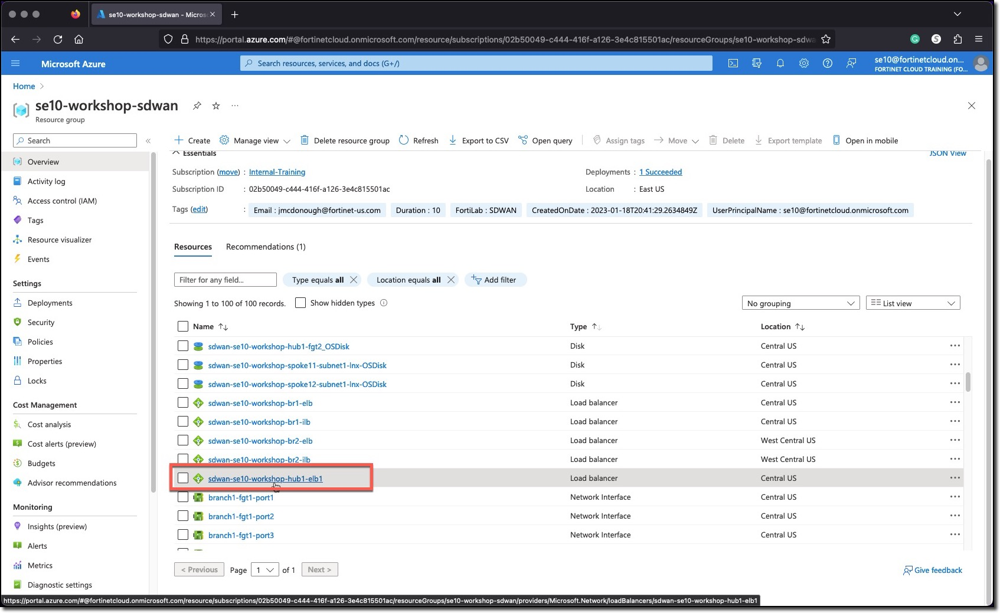
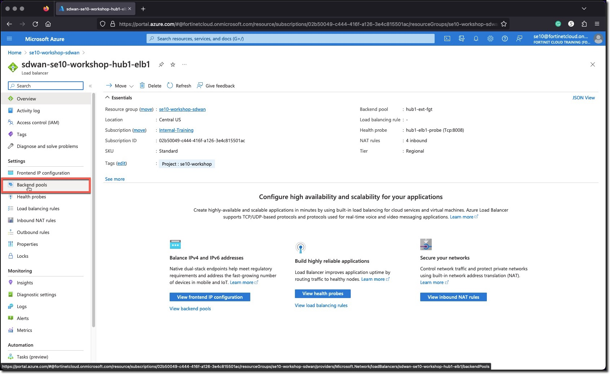
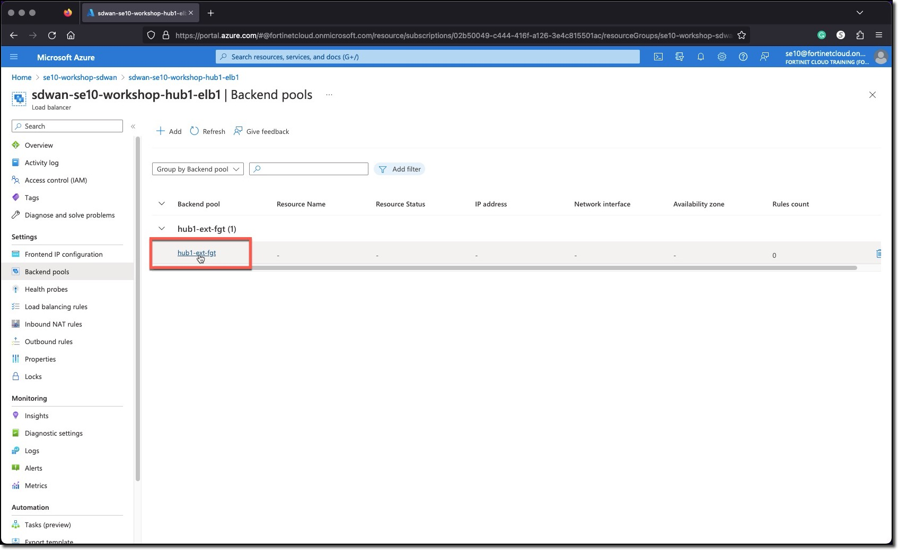
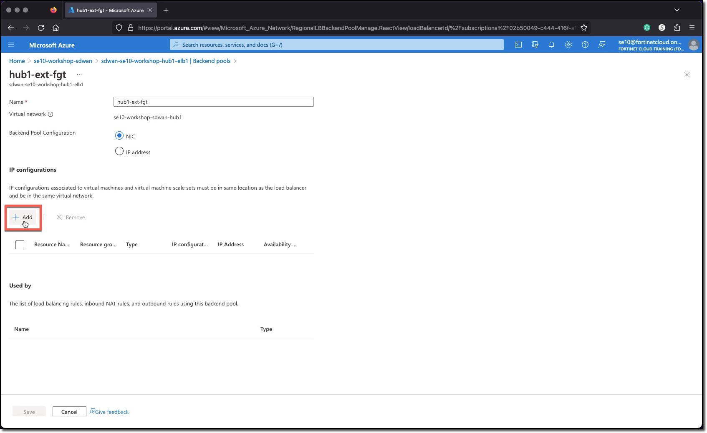
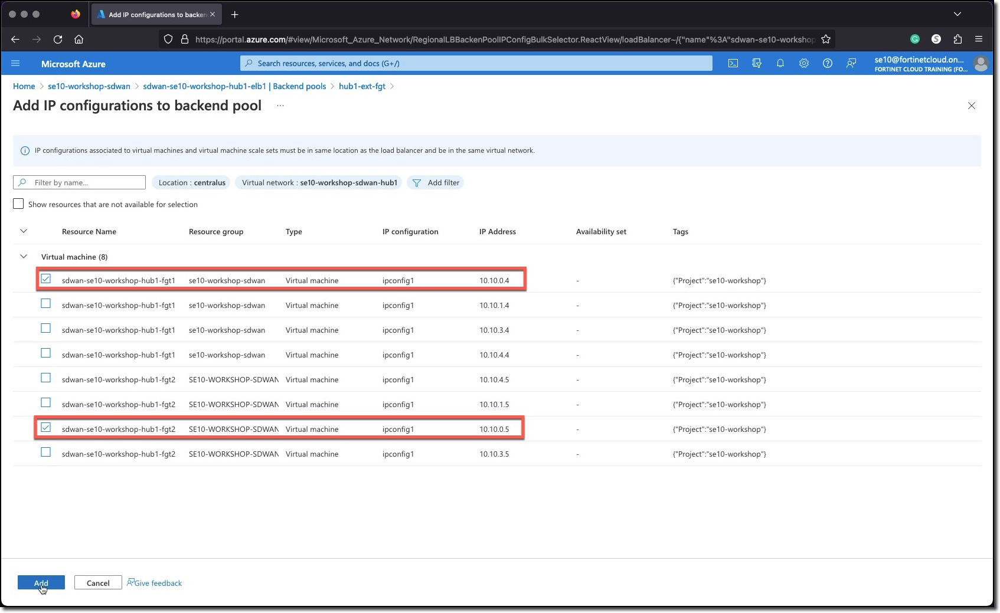
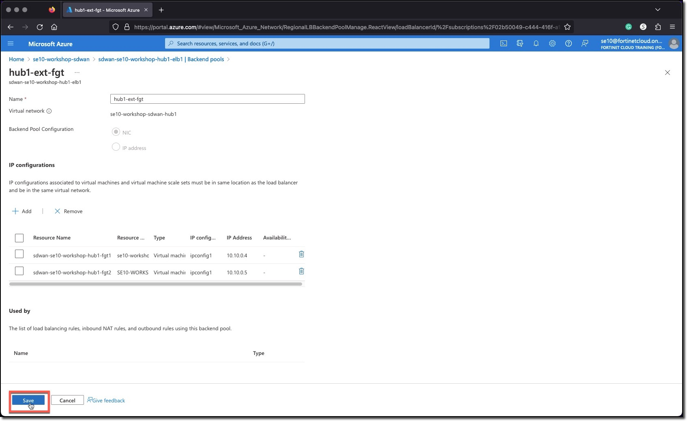

### Task 1 - Add FortiGates to Hub Load Balancer Backend Pool

1. **Select** the Hub External Load Balancer **sdwan-USERXX-workshop-hub1-elb1**
1. **Click** Backend pools
1. **Select** "hub1-ext-fgt"
1. **Click** "+Add"
1. **Select** sdwan-USERXX-workshop-hub1-fgt1 and sdwan-USERXX-workshop-hub1-fgt2 **port1 interfaces**
    * 10.10.0.4
    * 10.10.0.5
1. **Click** "Add"
1. **Click** "Save"

  
  
  
  
  
  
  