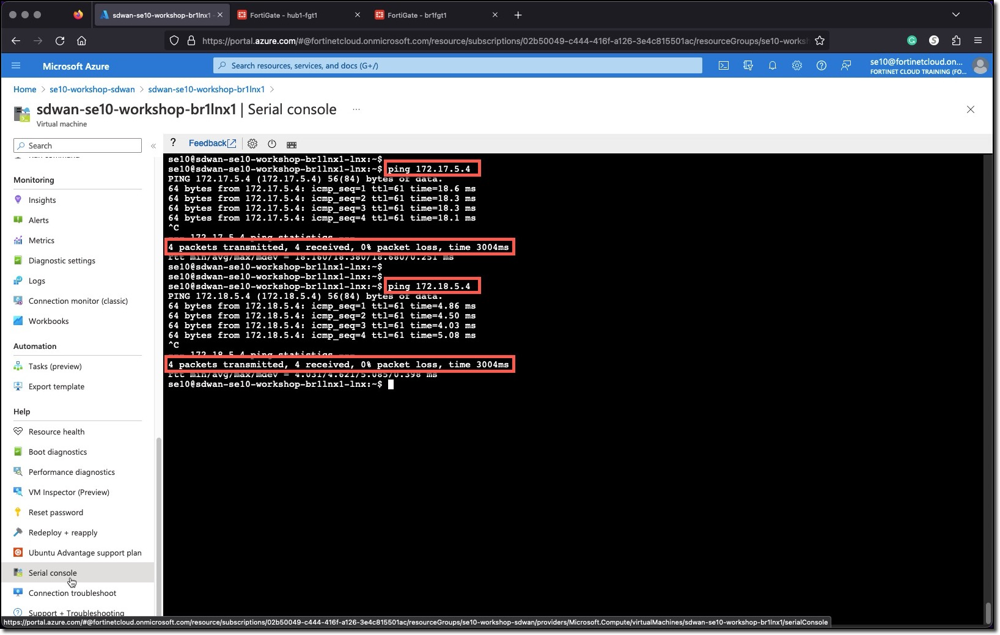
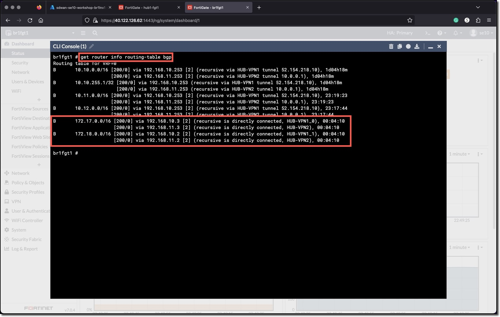

### Task 4 - Generate Traffic between Branches

1. **Connect** to the Branch1 Linux Host via the serial console - **sdwan-USERXX-workshop-br1lnx1**
1. **Generate** traffic to Branch2 Linux VM and Branch3 Linux VM

    ```bash
     ping 172.17.5.4
     ping 172.18.5.4
    ```

    

1. **Login** to any Branch FortiGate
1. **Check** from the CLI if an ADVPN shortcut has been created.
1. **Run** the command `get router info routing-table bgp`

    
