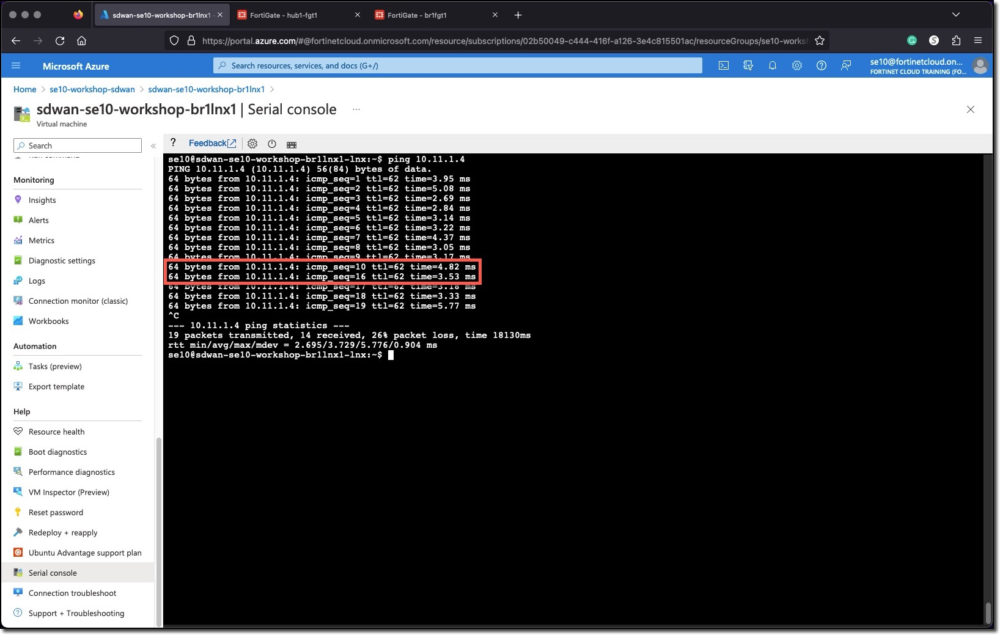

### Task 2 - Initiate Failover

1. **Login** to the Branch1 Primary FortiGate
    * It may be - **sdwan-USERXX-workshop-br1-fgt1** or **sdwan-USERXX-workshop-br1-fgt2**
1. **Initiate** a failover via the CLI

  ```bash
  execute ha failover set 1
  ```

  
  

* Monitor the number of **lost Pings** and the **failover time**
* How long did it take?
* Have the VPNs to the Hub been renegotiated upon failover or maintained?
