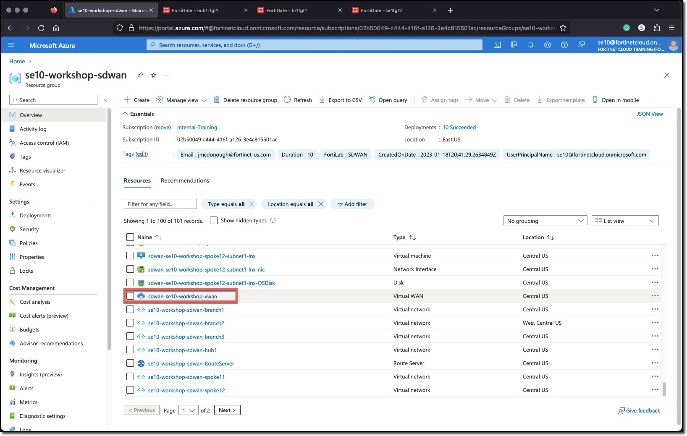
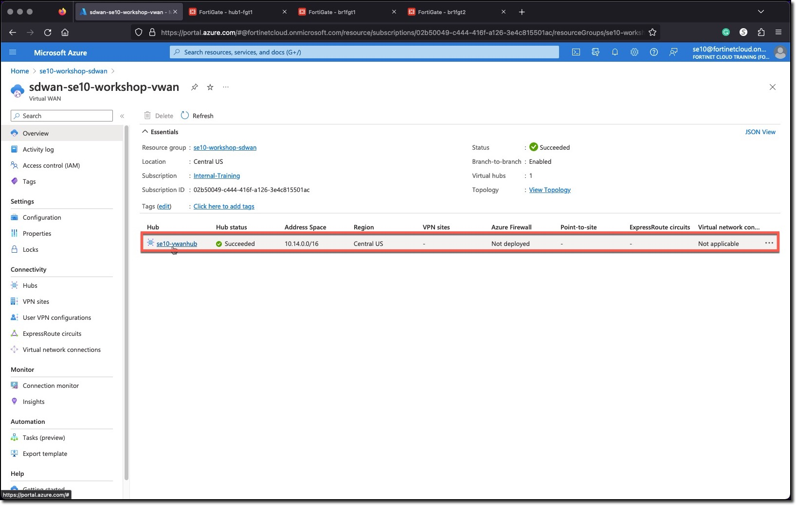
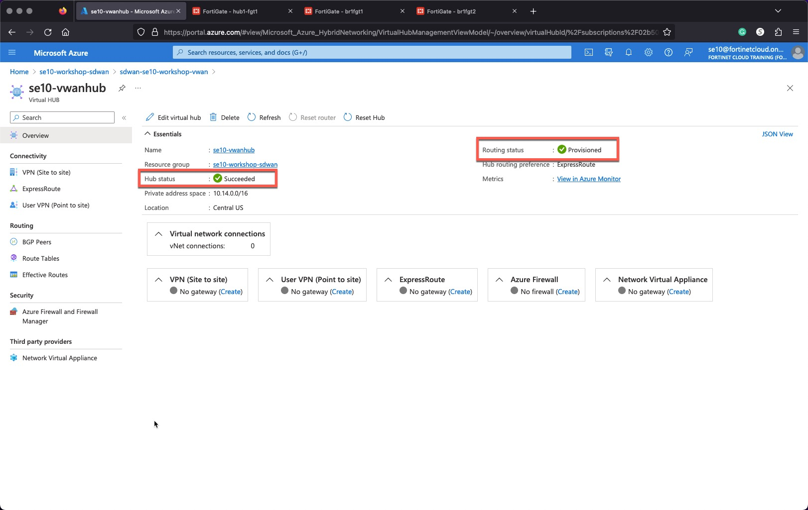

### Task 1 - Azure Virtual WAN Deployment

**Create** an Azure Virtual WAN (vWAN) and the vWAN Hub using the CLI commands below.

1. **Open** and **Maximize** a Cloud Shell environment

Use the Hub FortiGate location for the VWAN location.

1. Set the variable LOCATION to the location of the Hub FortiGates with this Azure CLI Command

    ```bash
    LOCATION=`az vm show -g ${USER}-workshop-sdwan -n sdwan-${USER}-workshop-hub1-fgt1 --query '[location]' -otsv`; echo ${LOCATION}
    ```

* The variable `${USER}` in the commands reads your username from the environment

    ```bash
    az network vwan create --name sdwan-${USER}-workshop-vwan --resource-group ${USER}-workshop-sdwan --location ${LOCATION} --type Standard
    ```

    > If you are prompted to install the extension `virtual-wan` answer `Y`

    ```bash
    az network vhub create --address-prefix 10.14.0.0/16 --name ${USER}-vwanhub --resource-group ${USER}-workshop-sdwan --vwan sdwan-${USER}-workshop-vwan --location ${LOCATION} --sku Standard
    ```

    > The second command can take several minutes to run, do not Ctrl-C to break out or stop the command. If your Cloud Shell session disconnects, reconnect and run `ps -ef` to determine if `az network vhub create...` command is still running. Once the command is no longer seen in the `ps` output the VWAN should be created. Use the command `az network vhub list` to view your VWAN hub.

    

1. **Navigate** to your Resource Group and verify that you see your vWAN
1. **Click** on your vWAN and verify that you see the virtual Hub you just deployed
1. **Click** on the vWAN Hub and verify that the deployment and routing status complete

    
    
    
