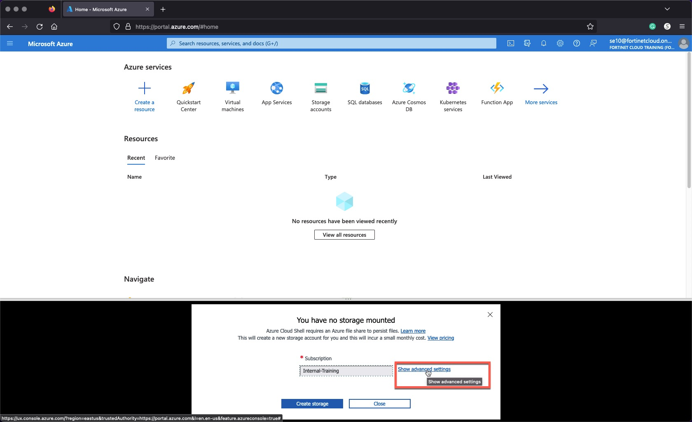

### Task 1 - Setup your AzureCloud Shell

* Login to Azure Cloud Portal [https://portal.azure.com/](https://portal.azure.com/) with the provided login/password

    
    

* Click the link "Skip for now (14 days until this is required)" do not click the "Next" button

    

* Click the "Next" button

    

* Click on Cloud Shell icon on the Top Right side of the portal

    

* Select **Bash**

    

* Click on **Show advanced settings**

    
* Select
  * Use existing Resource Group  - it ***should*** auto populate with USERXX-workshop-sdwan (USERXX is your Username)
  * Use existing Storage account - it ***should*** auto populate with USERXX########## (########## is a random string)
  * Use existing File Share  - type **cloudshellshare**
* Click "Attach Storage"

    

* You should now have access to Azure Cloud Shell console

    
