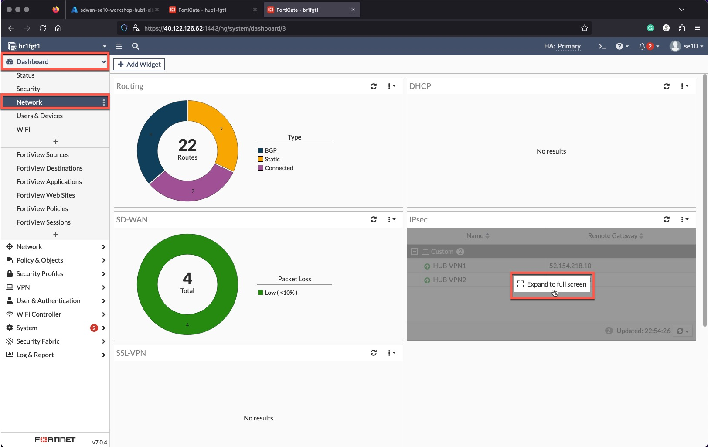
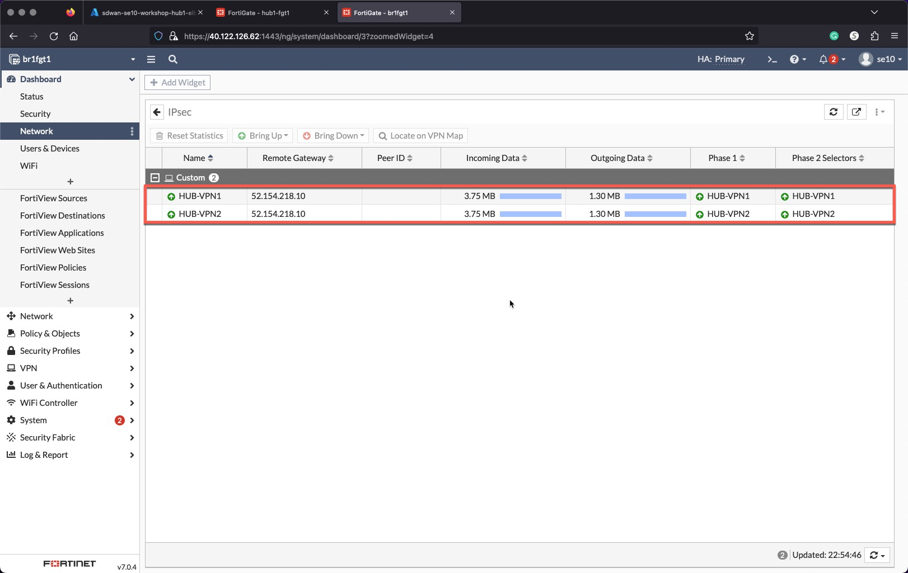

### Task 3 - Hub and Branch VPN Connectivity Verification

**Verify** that the FortiGates are responding to Azure Load Balancer Health Checks

1. **Select** the Hub External Load Balancer **sdwan-USERXX-workshop-hub1-elb1**
1. **Click** Insights
1. **Close** the Metrics panel

Green, Red, and/or Yellow lines indicate FortiGate reachability.

**Clicking** the "Refresh" button a few times, if yellow lines are present. Eventually (30 seconds) red and green lines will replace the yellow.

The diagram shows the load balancing rules along with the Inbound NAT Rules configured on the load balancer.

**Verify** that the VPN connections from the Branches to the Hub are UP, check Branches 1, 2 and 3.

1. **Login** to each Branch FortiGate
1. **Click** "Dashboard"
1. **Click** "Network"
1. **Click** "Expand to full screen" in the IPsec widget

    
    

**Verify** that BGP peering with the Hub is UP and that the Branch FortiGates learned the Hub and other Branches' CIDRs. Check all Branch FortiGates.

1. Open a FortiGate CLI session
1. Run the Command `get router info routing-table all`

    

* The current state of the Architecture is shown below.

    
