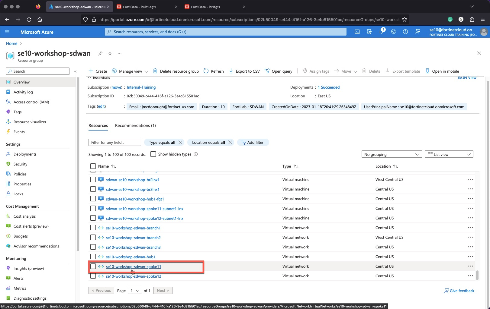
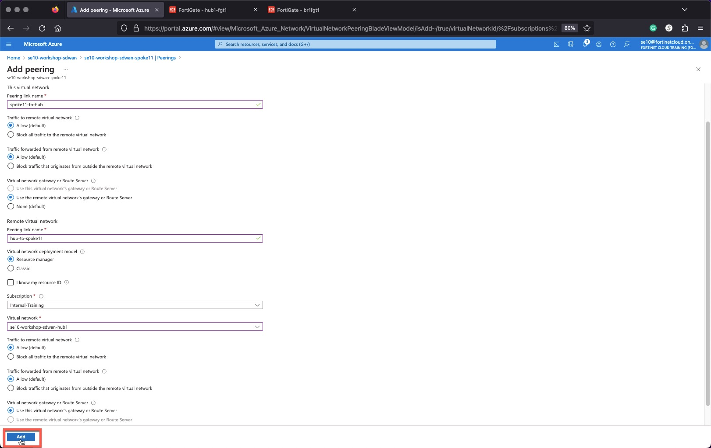

### Task 1 - Create Hub and Spoke VNET peering

Create a VNET peering between the Spoke11 VNET and the Hub VNET

1. **Select** Spoke VNET, **USERXX-workshop-sdwan-spoke11**
1. **Click** on Peerings
1. **Add** peering to Hub VNET, **USERXX-workshop-sdwan-hub1**

    This virtual network
    * Peering link name - `spoke11-to-hub`
    * Traffic to remote virtual network - "Allow (default)"
    * Traffic forwarded from remote virtual network - "Allow (default)"
    * Virtual network gateway or Route Server - "Use the remote virtual network's gateway or Route" Server

    Remote virtual network
    * Peering link name - `hub-to-spoke11`
    * Virtual network deployment model - "Resource manager"
    * Subscription - "Internal-Training"
    * Virtual network - "**USERXX-workshop-sdwan-hub1**"
    * Traffic to remote virtual network - "Allow (default)"
    * Traffic forwarded from remote virtual network - "Allow (default)"
    * Virtual network gateway or Route Server - "Use this virtual network's gateway or Route Server"

1. **Repeat** for Spoke12 VNET, **USERXX-workshop-sdwan-spoke12**
1. **Select** Spoke VNET, **USERXX-workshop-sdwan-spoke11**
1. **Click** on Peerings
1. **Add** peering to Hub VNET, **USERXX-workshop-sdwan-hub1**

    This virtual network
    * Peering link name - `spoke12-to-hub`

    Remote virtual network
    * Peering link name - `hub-to-spoke12`

>You will see errors until all the correct selections are made.

  
  
  
  

**Verify** that the Branch FortiGates have learned the Spoke11 VNET and Spoke12 VNET CIDRs. Run the Command `get router info routing-table all` on all the Branch FortiGates.
