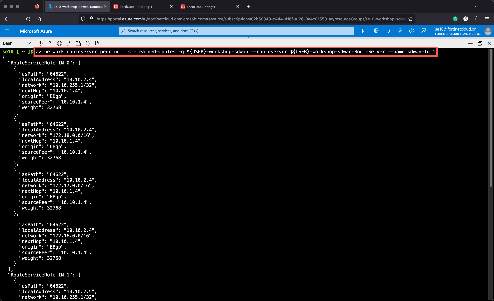

### Task 2 - Check Azure Route Server Configuration and Learned Routes

1. **Select** the Azure Route Server **USERXX-workshop-sdwan-RouteServer** contained within your Resource Group.
1. **Click** on Peers on the left side of the menu, verify the connection to the Hub FortiGates

    
    

1. **List** the routes learned by Azure Route Server, run the commands below from your Azure Cloud Shell

* The variable `${USER}` in the commands reads your username from the environment

```bash
az network routeserver peering list-learned-routes -g ${USER}-workshop-sdwan --routeserver ${USER}-workshop-sdwan-RouteServer --name sdwan-fgt1
az network routeserver peering list-learned-routes -g ${USER}-workshop-sdwan --routeserver ${USER}-workshop-sdwan-RouteServer --name sdwan-fgt2
```



```json
{
  "RouteServiceRole_IN_0": [
    {
      "asPath": "64622",
      "localAddress": "10.10.2.4",
      "network": "10.10.255.1/32",
      "nextHop": "10.10.1.4",
      "origin": "EBgp",
      "sourcePeer": "10.10.1.4",
      "weight": 32768
    },
    {
      "asPath": "64622",
      "localAddress": "10.10.2.4",
      "network": "172.18.0.0/16",
      "nextHop": "10.10.1.4",
      "origin": "EBgp",
      "sourcePeer": "10.10.1.4",
      "weight": 32768
    },
    {
      "asPath": "64622",
      "localAddress": "10.10.2.4",
      "network": "172.17.0.0/16",
      "nextHop": "10.10.1.4",
      "origin": "EBgp",
      "sourcePeer": "10.10.1.4",
      "weight": 32768
    },
    {
      "asPath": "64622",
      "localAddress": "10.10.2.4",
      "network": "172.16.0.0/16",
      "nextHop": "10.10.1.4",
      "origin": "EBgp",
      "sourcePeer": "10.10.1.4",
      "weight": 32768
    }
  ],
  "RouteServiceRole_IN_1": [
    {
      "asPath": "64622",
      "localAddress": "10.10.2.5",
      "network": "10.10.255.1/32",
      "nextHop": "10.10.1.4",
      "origin": "EBgp",
      "sourcePeer": "10.10.1.4",
      "weight": 32768
    },
    {
      "asPath": "64622",
      "localAddress": "10.10.2.5",
      "network": "172.18.0.0/16",
      "nextHop": "10.10.1.4",
      "origin": "EBgp",
      "sourcePeer": "10.10.1.4",
      "weight": 32768
    },
    {
      "asPath": "64622",
      "localAddress": "10.10.2.5",
      "network": "172.17.0.0/16",
      "nextHop": "10.10.1.4",
      "origin": "EBgp",
      "sourcePeer": "10.10.1.4",
      "weight": 32768
    },
    {
      "asPath": "64622",
      "localAddress": "10.10.2.5",
      "network": "172.16.0.0/16",
      "nextHop": "10.10.1.4",
      "origin": "EBgp",
      "sourcePeer": "10.10.1.4",
      "weight": 32768
    }
  ]
}
```

> The passive FortiGate will produce empty output

```json
{
  "RouteServiceRole_IN_0": [],
  "RouteServiceRole_IN_1": [],
  "value": null
}
```
