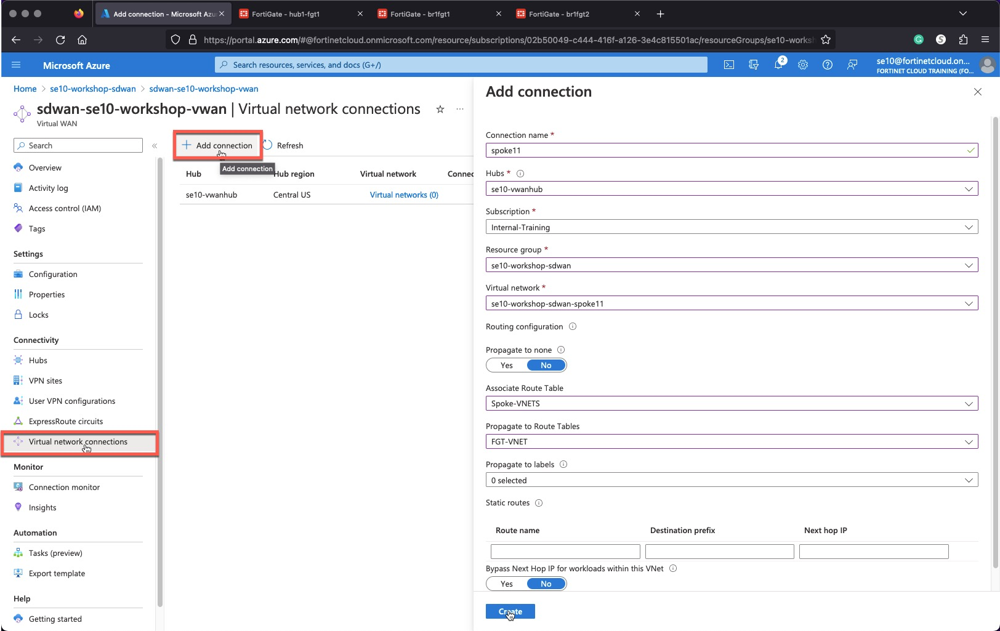
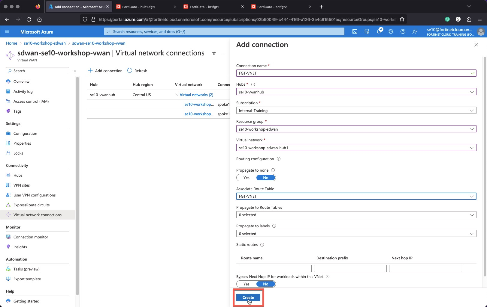
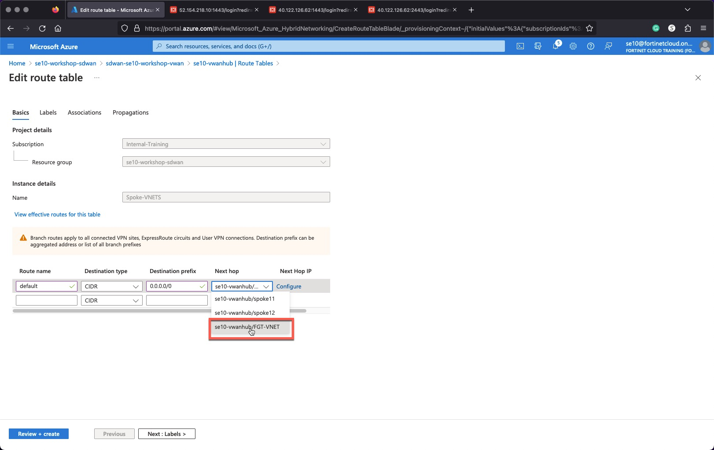
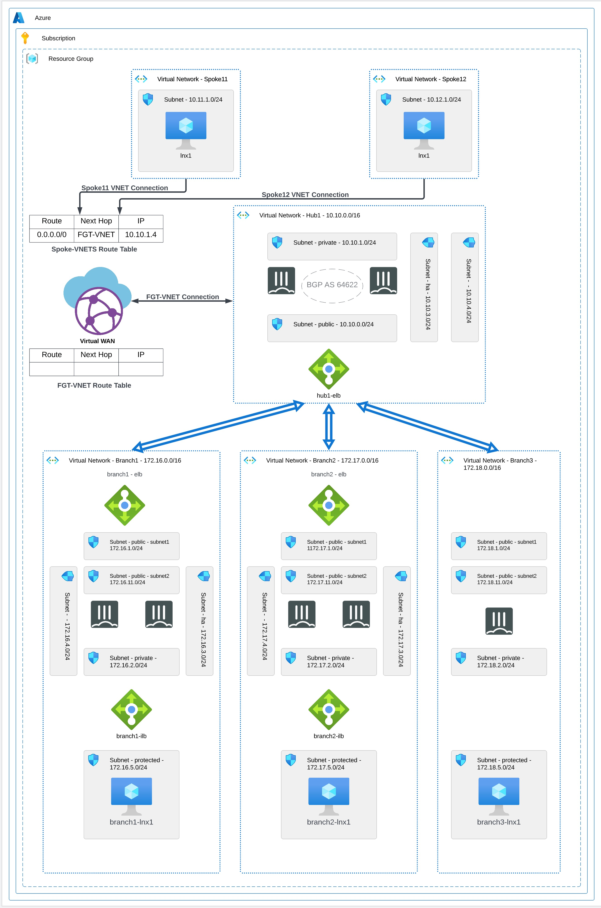

### Task 3 - VWAN Routing and VNET Connection Configuration

Create Virtual WAN Route Tables

1. **Select** your virtual WAN - **sdwan-USERXX-workshop-vwan**
1. **Select** your virtual Hub - **USERXX-vwanhub**
1. **Click** "Route Tables"
1. **Click** "+ Create route table"

    
    

1. **Create** two Route Tables
    * Name - `Spoke-VNETS`
    * Name - `FGT-VNET`
1. **Click** "Review + create"
1. **Click** "Create"

    
    
    

Create Virtual WAN  VNET Connections

1. **Select** your virtual WAN - **sdwan-USERXX-workshop-vwan**
1. **Click** "Virtual Network Connections"

## Add Spoke11 VNET

1. **Click** "+ Add Connection"
    * Connection Name - `spoke11`
    * Hubs - "USERXX-vwanhub"
    * Subscription - "Internal-Training"
    * Resource group - "USERXX-workshop-sdwan"
    * Virtual Network - "USERXX-workshop-sdwan-spoke11"
    * Propagate to none - "No"
    * Associate Route Table - "Spoke-VNETS"
    * Propagate to Route Tables - "FGT-VNET"
    * Leave other settings unchanged
1. **Click** "Create"

## Add Spoke12 VNET

1. **Click** "+ Add Connection"
    * Connection Name - `spoke12`
    * Hubs - "USERXX-vwanhub"
    * Subscription - "Internal-Training"
    * Resource group - "USERXX-workshop-sdwan"
    * Virtual Network - "USERXX-workshop-sdwan-spoke12"
    * Propagate to none - "No"
    * Associate Route Table - "Spoke-VNETS"
    * Propagate to Route Tables - "FGT-VNET"
    * Leave other settings unchanged
1. **Click** "Create"

## Add FortiGate Hub VNET

1. **Click** "+ Add Connection"
    * Connection Name - `FGT-VNET`
    * Hubs - "USERXX-vwanhub"
    * Subscription - "Internal-Training"
    * Resource group - "USERXX-workshop-sdwan"
    * Virtual Network - "USERXX-workshop-sdwan-hub1"
    * Propagate to none - "No"
    * Associate Route Table - "FGT-VNET"
    * Leave other settings unchanged
1. **Click** "Create"

    
    
    

Configure Spoke-VNETS Route Table

1. **Select** your virtual WAN - **sdwan-USERXX-workshop-vwan**
1. **Select** your virtual Hub - **USERXX-vwanhub**
1. **Click** "Route Tables"
1. **Click** "Spoke-VNETS"
1. **Add** Route
    * Route Name - `default`
    * Destination Type - "CIDR"
    * Destination prefix - `0.0.0.0/0`
    * Next hop - "FGT-VNET"
    * Next hop IP - **Click** "Configure"
        * Next hop IP - `10.10.1.4` <-- **Primary FGT port2 ip**
1. **Click** "Confirm"
1. **Click** "Review + create"
1. **Click** "Create"

      
      
      

Verify that this default route has been propagated to the Spokes VNETs

1. **View** Spoke11 Linux VM nic **Effective Routes**

      

* The current state of the Architecture is shown below.

      
